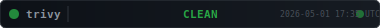
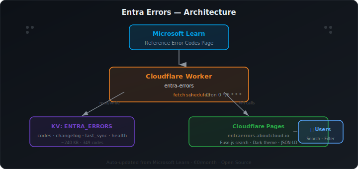

# AADSTS Entra Errors — Community Error Code Reference

> Free community AADSTS error code lookup for Microsoft Entra ID.  
> Search by code, scenario or plain English. Severity classification, Conditional Access trigger detection, fix hints — auto-updated from Microsoft Learn.

**Author:** [Antonio Russo](mailto:arusso@aboutcloud.io) · [aboutcloud.io](https://aboutcloud.io)

<p align="center">
  <a href="https://github.com/arusso-aboutcloud/AADSTS-Entra-Errors/actions/workflows/trivy-scan.yml"></a>
  <a href="./LICENSE"></a>
  
  
  
</p>

**Live:** [entraerrors.aboutcloud.io](https://entraerrors.aboutcloud.io)  
**API:** `https://api.aboutcloud.io/entra-errors`

---

## Architecture

<p align="center">
  
</p>

---

## What It Does

A fully automated, €0/month reference tool that scrapes the [Microsoft Entra ID authentication & authorization error codes](https://learn.microsoft.com/en-us/entra/identity-platform/reference-error-codes) page, classifies every error by severity and responsible party, adds plain-English descriptions and fix hints, and serves them through a searchable web UI.

**349 error codes** currently tracked, updated every 6 hours.

---

## Security Scan

<p align="center">
  <a href="https://github.com/arusso-aboutcloud/AADSTS-Entra-Errors/actions/workflows/trivy-scan.yml"></a>
</p>

This repository is automatically scanned by [Trivy](https://trivy.dev/) on every push and daily at midnight UTC. The badge above reflects the latest scan results in real time — it updates automatically via GitHub Actions.

<details>
<summary>📊 Latest Trivy Report (click to expand)</summary>

> The detailed scan report is generated on each run. See the [Actions tab](https://github.com/arusso-aboutcloud/AADSTS-Entra-Errors/actions/workflows/trivy-scan.yml) for full results.

| Scanner | Status |
|---|---|
| Secrets | Scanned on every push |
| Misconfigurations | Scanned on every push |
| Vulnerabilities | Scanned on every push |

</details>

---

## Cloudflare Infrastructure

### Worker

| Property | Value |
|---|---|
| Handlers | `fetch`, `scheduled` |
| Compatibility date | 2026-04-01 |
| Usage model | Standard |

**Bindings:**

| Name | Type | Details |
|---|---|---|
| `ENTRA_ERRORS` | KV Namespace | Error codes, changelog, sync metadata |
| `SEED_SECRET` | Secret | Authentication for admin endpoints |

**Cron Trigger:** Every 6 hours — scrapes Microsoft Learn and refreshes KV.

### Pages

| Property | Value |
|---|---|
| Deployment type | Direct upload (or Git-based — your choice) |
| Tech | Static HTML + Fuse.js 7.0 + custom CSS |

### KV Keys

| Key | Content | Size |
|---|---|---|
| `entra_errors_codes_v1` | All 349 classified error codes (JSON) | ~240 KB |
| `entra_errors_changelog_v1` | Change log | — |
| `entra_errors_last_sync_v1` | Last sync timestamp and stats | < 1 KB |
| `entra_errors_parser_health_v1` | Parser health check result | < 1 KB |

---

## API

**Base URL:** `https://api.aboutcloud.io/entra-errors`

### `GET /`
Returns full error code catalog.

```json
{
  "meta": {
    "total": 349,
    "last_sync": { "timestamp": "...", "total_codes": 349 },
    "source": "https://learn.microsoft.com/en-us/entra/identity-platform/reference-error-codes"
  },
  "codes": {
    "AADSTS50076": { "...": "..." }
  }
}
```

### `GET /stats` — Aggregate statistics  
### `GET /changelog` — Change log  
### `GET /code/:code` — Single error code lookup  

---

## Data Model

```json
{
  "AADSTS50126": {
    "short": "InvalidUserNameOrPassword - Error validating credentials...",
    "plain_english": "InvalidUserNameOrPassword - Error validating credentials due to invalid username or password.",
    "scenario": ["user-account"],
    "severity": "user-error",
    "who_fixes": "user",
    "ca_trigger": false,
    "fix_hint": "User must verify credentials. Admin can reset password in Microsoft Entra admin center.",
    "tags": ["user-error", "user-account"],
    "auto_classified": false,
    "needs_review": false,
    "source_description": "InvalidUserNameOrPassword - Error validating credentials...",
    "first_seen": "2026-04-01T22:47:39.272Z",
    "last_updated": "2026-04-01T22:47:39.272Z"
  }
}
```

### Severity Levels

| Severity | Badge | Meaning |
|---|---|---|
| `user-error` | 🟢 User Action | User needs to act (wrong password, MFA required, etc.) |
| `admin-config` | 🟠 Admin Config | Admin needs to fix configuration or policy |
| `developer` | 🟣 App / Dev | Developer needs to fix code or app registration |
| `microsoft-side` | ⚪ Microsoft Side | Transient Microsoft-side error — retry |

---

## Frontend Features

- 🔍 Fuse.js full-text search — weighted across code, description, tags, scenarios
- 🏷️ Severity filters — user-error, admin-config, developer, microsoft-side
- 🔴 Conditional Access badge — highlights CA-triggered errors
- 📋 Click-to-copy error codes
- 🌙 Dark theme (Entra-inspired)
- 📊 Live stats bar — total codes, breakdown by severity, CA triggers
- 🔗 Structured data (JSON-LD) for SEO

---

## Repo Structure

```
├── api/                  # Worker script
│   ├── worker.js         # Full worker source
│   └── wrangler.toml     # Worker configuration
├── web/                  # Pages frontend
│   ├── index.html        # Full frontend
│   └── wrangler.toml     # Pages configuration
├── scripts/              # Utilities
│   └── scrape_errors.py  # Reference scraper
├── .github/workflows/    # CI/CD
│   └── trivy-scan.yml    # Automated security scanning
├── architecture.svg      # Architecture diagram
├── trivy-badge.svg       # Auto-updated security badge
├── LICENSE
└── README.md
```

---

## Quick Start

1. **Clone:** `git clone https://github.com/arusso-aboutcloud/AADSTS-Entra-Errors.git`
2. **Install Wrangler:** `npm install -g wrangler`
3. **Create KV namespace:** `wrangler kv:namespace create ENTRA_ERRORS`
4. **Set secret:** `wrangler secret put SEED_SECRET`
5. **Update `wrangler.toml`** with your KV namespace ID, zone, and route
6. **Deploy:** `wrangler deploy`

---

## License

MIT — see [LICENSE](./LICENSE) for full text.

> 💼 **Using this commercially?** MIT licensed and free for personal, educational, and open-source projects.  
> Building something commercial (SaaS, managed services, reselling)? I'd love to chat —  
> [about the author](https://aboutcloud.io/author/) · [contact me](https://aboutcloud.io/author/)

---

*Last reconciled: 2026-04-29*
